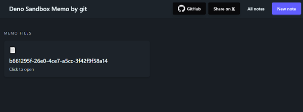
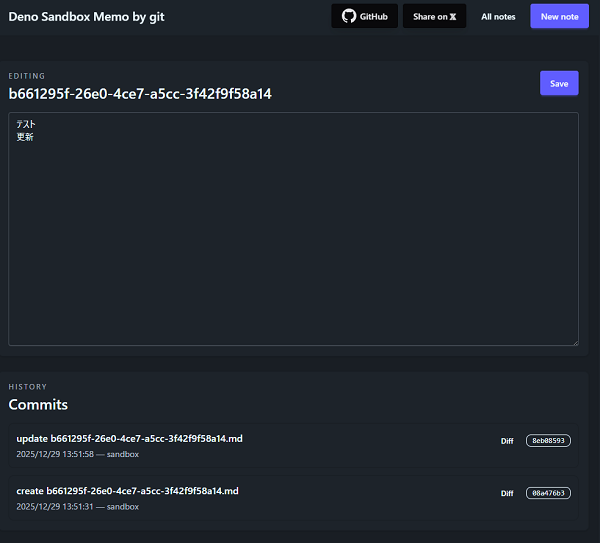

# Deno Sand box Memo by git

A memo application that uses Deno Sandbox to run git commands securely.




## Environment

Create a `.env` at the project root before setup. Minimum required values:

```
DENO_DEPLOY_TOKEN=<your Deno Deploy token>
APP_ORIGIN=<application origin URL, e.g., http://localhost:8000>
APP_ENV=dev or prod
```

## Setup

Install dependencies and prepare the sandbox:

```bash
deno task setup
```

## Run

Start the app:

```bash
deno task dev
```

## What this app is

This app manages memos by running git inside Deno Sandbox. Each memo is stored and versioned via git commands executed within the sandboxed environment, providing history, diffs, and restore operations while keeping execution isolated.

## 📄 License

MIT

---

Built with ❤️ using Deno.

<a href="https://fresh.deno.dev">
  
</a>